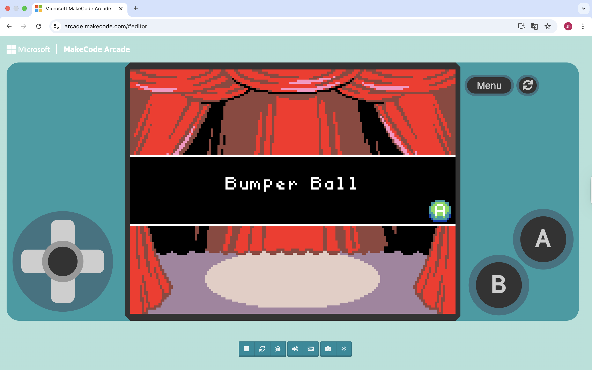
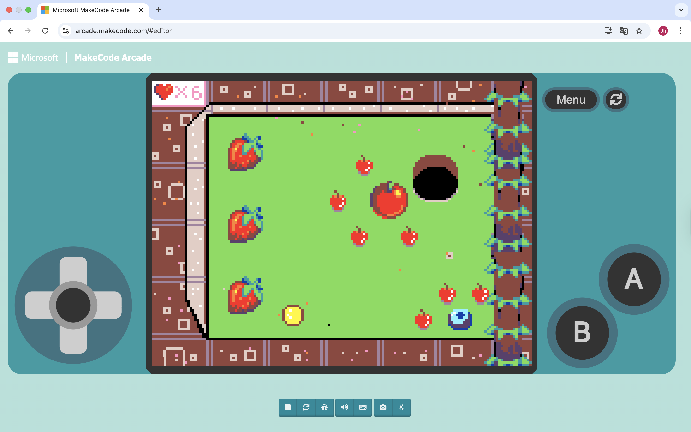
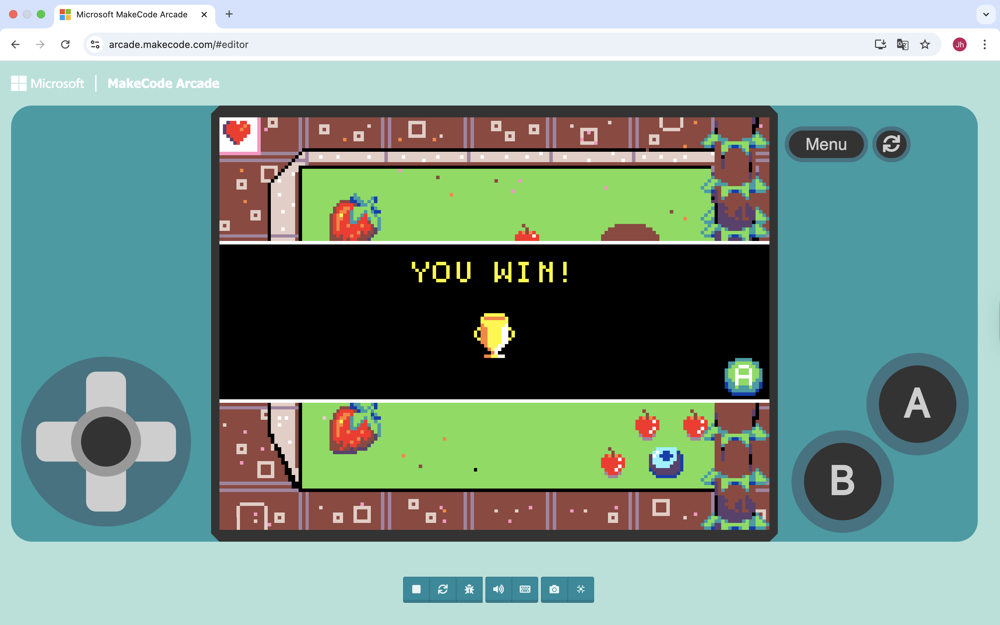

# Bumper-Ball
> Bumper Ball is a single-player arcade-style game. The player's goal is to hit the ball into the hole within a limited number of steps while avoiding various obstacles.
> Live demo [_here_](https://makecode.com/_4p2Hh8HpJHtb).
> Video presentation [_here_](https://utsmeet.zoom.us/rec/share/RsRqBwC4x0GP17h44kA4Md_qiPB3p2ZFqPUH0PgKAzvQxDcX90fFciE4UmPZkiNB.g8lshcdpwjmcN55v).

## Table of Contents
- [General Information](#general-information)
- [Technologies Used](#technologies-used)
- [Features](#features)
- [Screenshots](#screenshots)
- [Setup](#setup)
- [Usage](#usage)
- [Project Status](#project-status)
- [Room for Improvement](#room-for-improvement)
- [Acknowledgements](#acknowledgements)
- [Contact](#contact)

## General Information
- **project overview** A single-player arcade-style game where you hit the ball into the hole within a limited number of steps.
- **Project Objectives/Challenges**
1. Design an interesting and captivating single-player ball game
2. Players complete hitting the ball into the hole within a limited number of moves
3. Add obstacles to increase the game's difficulty
4. Learn and demonstrate the game mechanics and programming logic
- **Motivation** By developing this mini-game, I aim to enhance my programming skills, game logic design abilities, and practice concepts such as code comments, functions, and classes.
## Technologies Used
- Microsoft MakeCode Arcade
- Programming methods: Drag-and-drop Blocks, JavaScript (optional), Python (experimental)
## Features
- Players can control the direction and force of the ball's movement
- The limited number of steps increases the challenge
- Obstacles enhance the strategic nature of the game
- Scoring or step count statistics
## Screenshots
### Game entry interface

### Game start interface

### Game victory interface

## Setup
### Project Requirements / Dependencies
- **Microsoft MakeCode Arcade** (browser or desktop app)  
- Recommended browsers: Chrome / Edge / Firefox (latest versions)  
- All project files and assets (images, sprites, etc.) are included in this repository  
### Installation / Setup / Running the Project
1. Open a browser and go to [Microsoft MakeCode Arcade](https://arcade.makecode.com/)  
2. Click **“New Project”** or **“Import Project”**  
3. Import the project files from this repository:  
   - Click **“Import”** → **“Import Project”** → select the project file (.mc or .png)  
4. Switch to the Python editor: **“JavaScript / Python”** → **Python**  
5. Click **“Run”** to start the game in the built-in simulator  
6. Use arrow keys to control the ball:  
   - ↑ ↓ ← → move the ball  
   - Objective: hit the ball into the goal within the limited moves
## Usage
The game can be played directly in the MakeCode Arcade simulator.
### How to Play
1. Run the project in the Python editor simulator.  
2. Use the arrow keys to control the ball:  
   - ↑ move up  
   - ↓ move down  
   - ← move left  
   - → move right  
3. The objective is to hit the ball into the goal within the limited number of moves.  
4. Obstacles on the field increase the difficulty, requiring careful planning of moves.
### Example Code Snippet
```python
# Ball movement, charging, and collisions
def on_update():
    global vx, vy, charging, charge_time, dir_x, dir_y, steps

    # Update ball position with velocity
    if vx != 0 or vy != 0:
        ball.x += vx
        ball.y += vy
        vx *= 0.98
        vy *= 0.98

        # Bounce off walls
        if ball.x <= 20 or ball.x >= 140:
            vx = -vx
        if ball.y <= 20 or ball.y >= 110:
            vy = -vy

        # Bounce off obstacles
        for obs in obstacles:
            if ball.overlaps_with(obs):
                vx = -vx
                vy = -vy

    # Check input for charging shot
    left = controller.left.is_pressed()
    right = controller.right.is_pressed()
    up = controller.up.is_pressed()
    down = controller.down.is_pressed()

    new_dir_x = (right - left)
    new_dir_y = (down - up)

    if new_dir_x != 0 or new_dir_y != 0:
        if not charging:
            charging = True
            charge_time = 0
            dir_x = new_dir_x
            dir_y = new_dir_y
        else:
            charge_time = min(charge_time + 1, max_charge)
    else:
        if charging:
            speed = charge_time / max_charge * 3
            length = (dir_x**2 + dir_y**2)**0.5
            if length != 0:
                vx = dir_x / length * speed
                vy = dir_y / length * speed
            charging = False
            charge_time = 0
            steps -= 1
            info.set_life(steps)

# Check for goal
def check_hole():
    if ball.overlaps_with(hole):
        game.over(True)
    elif steps <= 0 and (vx == 0 and vy == 0):
        game.over(False)

game.on_update(on_update)
game.on_update(check_hole)
```
## Project Status
Project is: complete
The core prototype of Bumper Ball has been fully implemented, including the ball movement mechanics, charging system, collision detection with walls and obstacles, and goal detection. Although only one level is currently available, all main gameplay features are functional. Future improvements could include adding multiple levels, new obstacles, and enhanced graphics, but the current prototype meets the assignment requirements.
## Room for Improvement
- **Improvement points** : 
  - Add more levels and obstacle types to enhance the diversity of the game 
  - Optimize the game interface and animations to provide players with a smoother experience 
  - Add sound effects and background music to enhance immersion 
  - Add a scoring system or leaderboard to enhance competitiveness
## Acknowledgements
- The project's inspiration comes from classic arcade mini-games, such as Mini Golf and pinball games.
- Thanks to the official documentation and online tutorials provided by Microsoft MakeCode Arcade for their guidance.
- Thanks to Stack Overflow and the GitHub community for their assistance during the development process.
- Special thanks to my classmates and friends who received feedback during the project process.
## Contact
Created by @Freya Chow - feel free to contact me!


